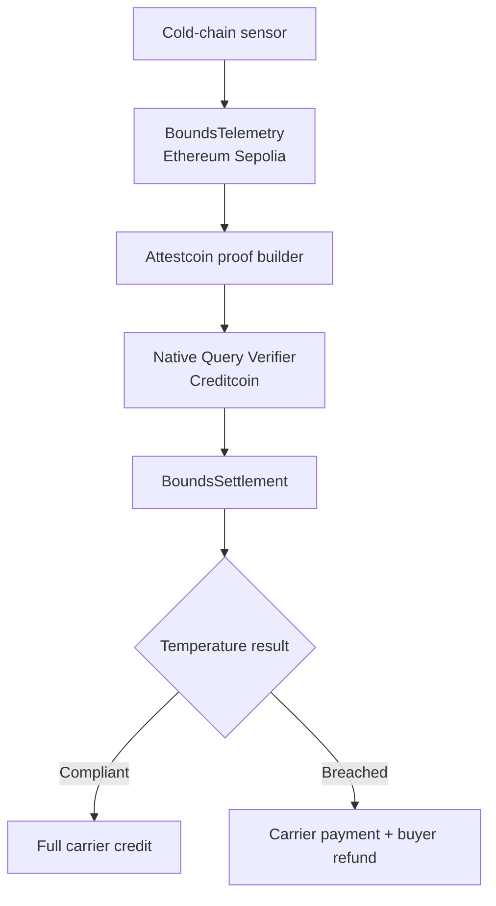

# Bounds

**Live demo:** [bounds-hq.netlify.app](https://bounds-hq.netlify.app/)

Bounds is a DePIN settlement protocol that turns Attestcoin-verified cold-chain telemetry into enforceable payments on Creditcoin.

**Physical conditions. Enforceable consequences.**

## The problem

Cold-chain sensors can detect unsafe temperatures, but shipment payments, penalties, and disputes still depend on fragmented databases and trusted intermediaries. A carrier, buyer, or monitoring provider can disagree about which record is authoritative.

## The solution

Bounds connects device-originated telemetry on Ethereum with programmable escrow on Creditcoin:

1. An authorized sensor commits shipment telemetry on Ethereum Sepolia.
2. The Attestcoin Protocol proves that source-chain transaction to Creditcoin.
3. Bounds verifies the proof through Creditcoin’s native query verifier.
4. The settlement contract decodes the authenticated telemetry event.
5. A compliant shipment releases full payment to the carrier.
6. A breached shipment applies the agreed penalty and refunds the buyer.

No centralized oracle operator decides the result.

## Architecture



## Attestcoin integration

Attestcoin is a core execution dependency, not a display-only integration.

Bounds uses:

- `@gluwa/usc-sdk` to wait for source-block attestation and generate the transaction proof.
- `@gluwa/asc-contracts` for the official EVM transaction decoder and native verifier interface.
- Creditcoin’s native query verifier at `0x0000000000000000000000000000000000000FD2`.
- Ethereum Sepolia chain key `1`.
- Verified source-contract, event-signature, transaction-status, emitter, and telemetry-field checks.
- A deterministic query ID to prevent proof replay.

The settlement transaction cannot classify or pay a shipment unless the supplied Ethereum transaction passes Attestcoin verification.

## Live testnet deployments

### Ethereum Sepolia

- `BoundsTelemetry`: [`0x4b403e46800A485fdE2a0be2228228f78f20C7D4`](https://sepolia.etherscan.io/address/0x4b403e46800A485fdE2a0be2228228f78f20C7D4)
- Deployment transaction: [`0x25aac78a...e7e5`](https://sepolia.etherscan.io/tx/0x25aac78a6e9e5d32e30d9fa0eabf649e2d626881c3216d90ca23cf330b40e7e5)
- Compliant telemetry: [`0x88b3be31...d3c`](https://sepolia.etherscan.io/tx/0x88b3be315db41b61d5369693691f395d11765149f205ee5119ac120286263d3c)
- Breach telemetry: [`0x6cf74d0a...fa3`](https://sepolia.etherscan.io/tx/0x6cf74d0a14391598734aaf07b79801d02a4d9d06386ca0cd152a45216e2c6fa3)

### Creditcoin Testnet

- `BoundsSettlement`: [`0x4b403e46800A485fdE2a0be2228228f78f20C7D4`](https://creditcoin-testnet.blockscout.com/address/0x4b403e46800A485fdE2a0be2228228f78f20C7D4)
- Deployment transaction: [`0x1daa10db...9372`](https://creditcoin-testnet.blockscout.com/tx/0x1daa10db4909d5caa0ad5139e0c54bb9fdb4ff5f4677ab3aba120b5776c59372)
- Compliant Attestcoin settlement: [`0x76711508...dbb5`](https://creditcoin-testnet.blockscout.com/tx/0x76711508668f8d214a53ed198d72649ff9e714c7cc94616cf3cedc9310afdbb5)
- Breach Attestcoin settlement: [`0x71acd33e...9bdb`](https://creditcoin-testnet.blockscout.com/tx/0x71acd33e6c7500e5ba7f5d28d701e69a88e934a77fc971da87a9a41da19a9bdb)

The contracts share the same address because the same deployer account used the same creation nonce on two different chains.

## Verified settlement scenarios

| Scenario | Telemetry | Escrow result |
| --- | --- | --- |
| Compliant | 4.00°C to 4.50°C, 0 seconds outside bounds | Carrier credited 1.00 tCTC |
| Breached | 4.20°C to 10.10°C, 120 seconds outside bounds | Carrier credited 0.75 tCTC; buyer refunded 0.25 tCTC |

Both scenarios were executed with real Attestcoin proofs and confirmed on Creditcoin Testnet.

## Contracts

### `BoundsTelemetry`

- Maintains an owner-controlled sensor allowlist.
- Accepts telemetry only from authorized sensor addresses.
- Records shipment nonce, temperature extrema, breach duration, timestamp, and telemetry hash.
- Emits the canonical `TelemetryCommitted` source event.

### `BoundsSettlement`

- Escrows native tCTC for a shipment.
- Restricts execution to Creditcoin Testnet and Ethereum Sepolia proofs.
- Verifies transaction inclusion and continuity through Attestcoin.
- Decodes the authenticated Ethereum receipt and telemetry event.
- Rejects failed transactions, incorrect emitters, malformed events, and replayed proofs.
- Credits participants using a pull-payment withdrawal model.

## Stack

- Next.js 16
- React 19
- TypeScript
- wagmi and viem
- Solidity and Foundry
- `@gluwa/usc-sdk` 0.18.0
- `@gluwa/asc-contracts` 0.2.1
- Ethereum Sepolia
- Creditcoin Testnet
- Attestcoin Protocol

## Local development

Install dependencies:

```bash
pnpm install
```

Copy the environment template:

```bash
cp .env.example .env
```

Populate the required RPC URLs, contract addresses, and test-wallet keys. Never commit populated environment files or private keys.

Start the application:

```bash
pnpm dev
```

Run frontend checks:

```bash
pnpm lint
pnpm build
```

Run all contract tests:

```bash
pnpm contracts:test
```

Simulate source telemetry locally:

```bash
pnpm sensor:safe
pnpm sensor:breach
```

Submit a source transaction by adding `--submit`:

```bash
pnpm sensor:safe -- --submit
```

Settle an Ethereum transaction through Attestcoin:

```bash
pnpm attest:settle -- <SOURCE_TRANSACTION_HASH>
```

If Node cannot reach the dual-stack proof endpoint while `curl -4` succeeds, prefer IPv4 for that command:

```bash
NODE_OPTIONS=--dns-result-order=ipv4first pnpm attest:settle -- <SOURCE_TRANSACTION_HASH>
```

## Tests

The Foundry suite contains **21 passing tests**:

- 13 source telemetry and sensor-authorization tests.
- 8 attested settlement, escrow, payout, chain validation, emitter validation, withdrawal, and replay-protection tests.

## Repository records

Machine-readable deployment and proof records are available in:

- `deployments/ethereum-sepolia.json`
- `deployments/creditcoin-testnet.json`

## Developer resources

- [Attestcoin Protocol](https://attestcoin.org/)
- [Developer documentation](https://docs.attestcoin.org/)
- [Chains and environments](https://docs.attestcoin.org/attestcoin-protocol/attestcoin-protocol-chains-environments)
- [Guided tutorials](https://docs.attestcoin.org/attestcoin-protocol/guided-tutorials)
- [Attestcoin SDK](https://docs.attestcoin.org/attestcoin-protocol/dapp-builder-infrastructure/attestcoin-sdk-usc-sdk)